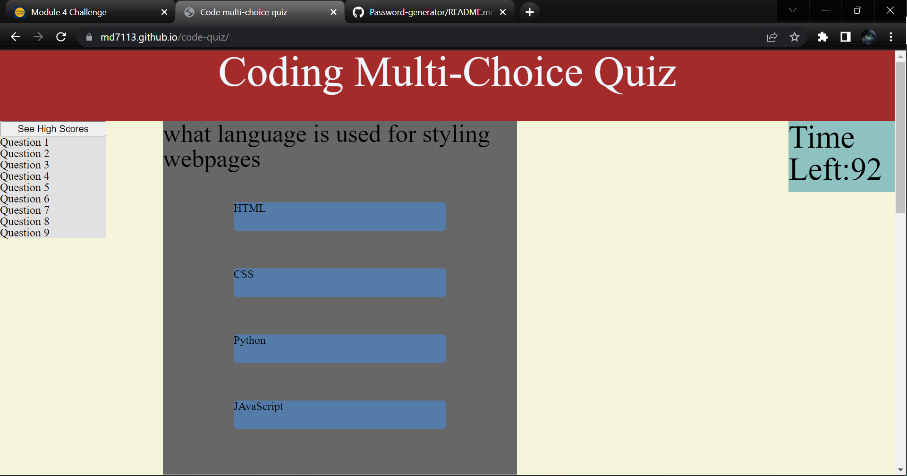

# code-quiz


## Deployed link
* [Coding Mulitiple choice Quiz](https://md7113.github.io/code-quiz/)

## site picture



## Technologies Used
- HTML : Used to format the content of the page
- CSS : Used to style the HTML on the web browser
- JavaScript : Used to give the page logical functions and a dynamic interface
- Git : Used to version control the code during the creation process
- GitHub : hosting the repositroy responsible for the website

## Authors
- All coding styling and content was writen and produced by Mason Davis

## summary
This repository contains all the code for a quiz on coding. it contains a scoreboard and an interactive game play.

## Code Snippet
This is a snippet Showing the formula used to randomize the question order, this is the bases for the code quiz.

```javaScript
function randQues() {
    randArrEnd = []
    randArrStart = [q1,q2,q3,q4,q5,q6,q7,q8,q9,q10]
    for( i=0 ; i < questionNum.length;i++){
    randOrder = Math.floor(Math.random() * randArrStart.length)
    randArrEnd.push(randArrStart[randOrder])
    randArrStart.splice(randOrder, 1)
    }
    
}
```


## Author links
[LinkedIn](https://www.linkedin.com/in/davis-mason-t/)
[GitHub](https://github.com/Md7113)